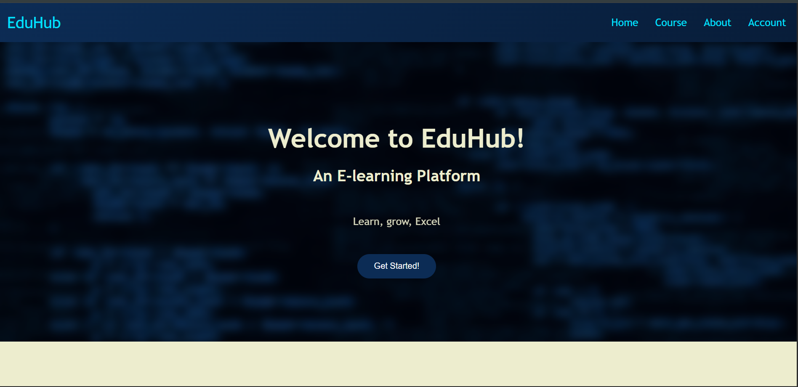
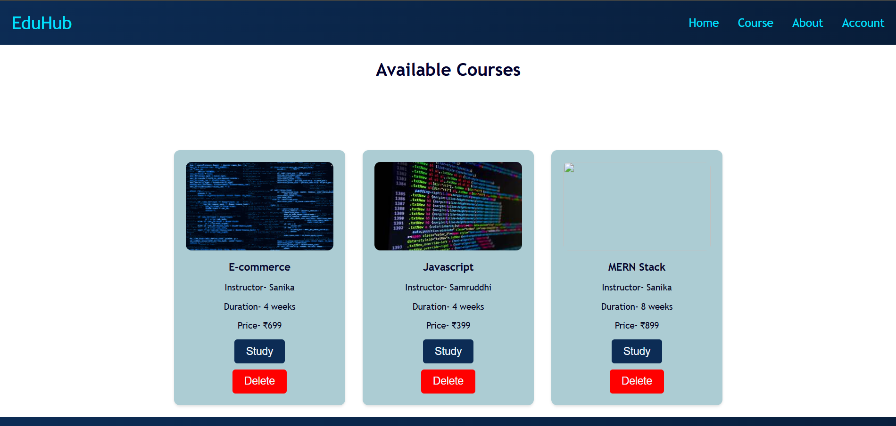
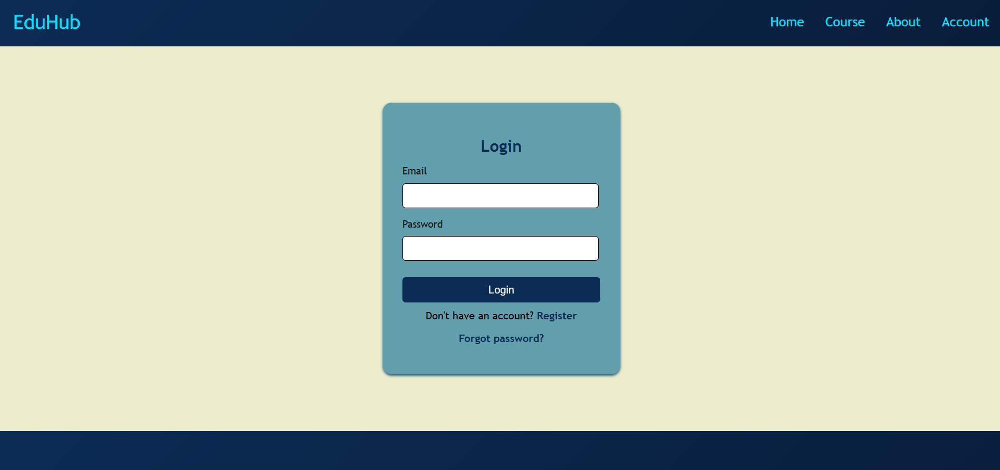
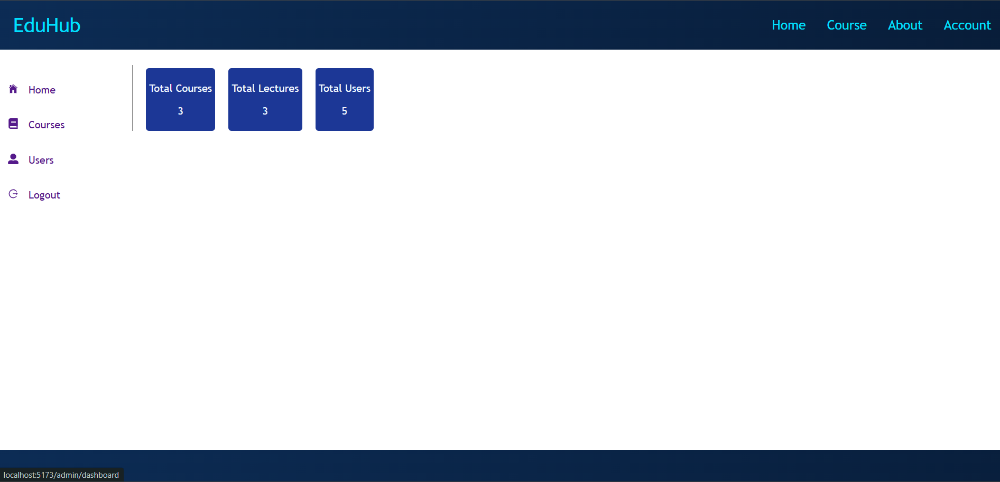

# EduHub — E-Learning Platform

A full-stack e-learning web application where students can browse courses, enroll, and learn through video lectures. Includes an admin panel for managing courses and users.

---

## Screenshots

| Home | Courses | Login | Admin |
|------|---------|-------|-------|
|  |  |  |  |

---

## Features

- Browse and search courses
- User registration with email OTP verification
- JWT-based authentication
- Course enrollment & payment integration
- Video lecture streaming
- Forgot password / reset via email
- Admin dashboard — manage courses, users, and lectures

---

## Tech Stack

| Layer | Technology |
|-------|-----------|
| Frontend | React.js, Vite, React Router |
| Backend | Node.js, Express.js |
| Database | MongoDB Atlas + Mongoose |
| Auth | JWT, bcrypt |
| Email | Nodemailer (Gmail) |
| File Uploads | Multer |

---

## Project Structure

```
E-learningWeb/
├── frontend/       # React + Vite app
└── server/         # Node.js + Express API
```

---

## Local Setup

### Prerequisites
- Node.js v18+
- MongoDB Atlas account

### Backend

```bash
cd E-learningWeb/server
npm install
cp .env.example .env   # fill in your values
npm run dev
```

### Frontend

```bash
cd E-learningWeb/frontend
npm install
cp .env.example .env   # fill in your values
npm run dev
```

---

## Environment Variables

### Backend (`server/.env`)

| Variable | Description |
|----------|-------------|
| `DB` | MongoDB Atlas connection string |
| `Jwt_Sec` | JWT signing secret |
| `Activation_Secret` | Email activation token secret |
| `Forgot_Secret` | Forgot password token secret |
| `Gmail` | Gmail address for sending emails |
| `Password` | Gmail app password |
| `frontendurl` | Deployed frontend URL (for CORS) |

### Frontend (`frontend/.env`)

| Variable | Description |
|----------|-------------|
| `VITE_API_URL` | Deployed backend URL |

---

## Deployment

- **Frontend** → [Vercel](https://vercel.com) — set `VITE_API_URL` to your Render backend URL
- **Backend** → [Render](https://render.com) — set all env variables from the table above

---

## Team

| Name | Role |
|------|------|
| Sanika Deshkar | Full Stack Developer · [GitHub](https://github.com/Sanika-deshkar) · [LinkedIn](https://www.linkedin.com/in/sanika-deshkar/) |
| Anushka Patil | Developer |
| Samruddhi Raut | Developer |
